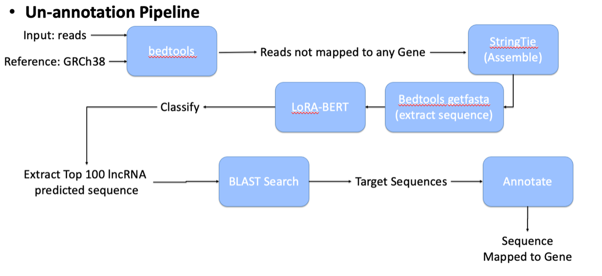

# End-to-End Pipeline 

* input: reads.bam and GRCh38.fasta -> BEDtools & StringTie & Bedtools getfasta (Using Galaxy tools official website) -> output1.fasta
* output1.fasta -> LoRA-BERT -> d0W1R1.csv
* d0W1R1.csv -> Top100.py -> d0W1R1_top100.fasta
* d0W1R1_top100.fasta -> NCBI BLASTn (official website server) -> d0W1R1_BLAST.txt
* d0W1R1_BLAST.txt -> BLAST_Target.py -> d0W1R1_novel.csv

LoRA-BERT model: https://github.com/Nick-Jeon/LoRA_BERT.git

# LUCID_Novel-lncRNA

## 1. Novel LncRNA Detection Pipeline
### 1.1. Top100.py
*Example command prompt
python Top100.py -i ./Data/LoRA_BERT/d0W1R1.csv -f ./Data/LoRA_BERT/d0W1R1.fasta -o d0W1R1_top100.fasta

### 1.2. BLAST_Target.py
*Example command prompt
python BLAST_Target.py -i ./Data/d0W1R1_BLAST.txt -o d0W1R1_novel.csv

## 2. Reverse: Calculating TPM/Counts from Target Sequence

### 2.1. TargetSequence_location.py
*Example command prompt
python TargetSequence_location.py -i ./Data/novel_lncRNA -o gene_location.csv

### 2.2. Location_StringTie.py
*Example command prompt
python Location_StringTie.py -i gene_location.csv -s ./Data/Strintie_output

# RCT Script
The script under the /src directory currently runs the pipeline steps 1 and 2.  Parts that require Galaxy tools is not added to the script
