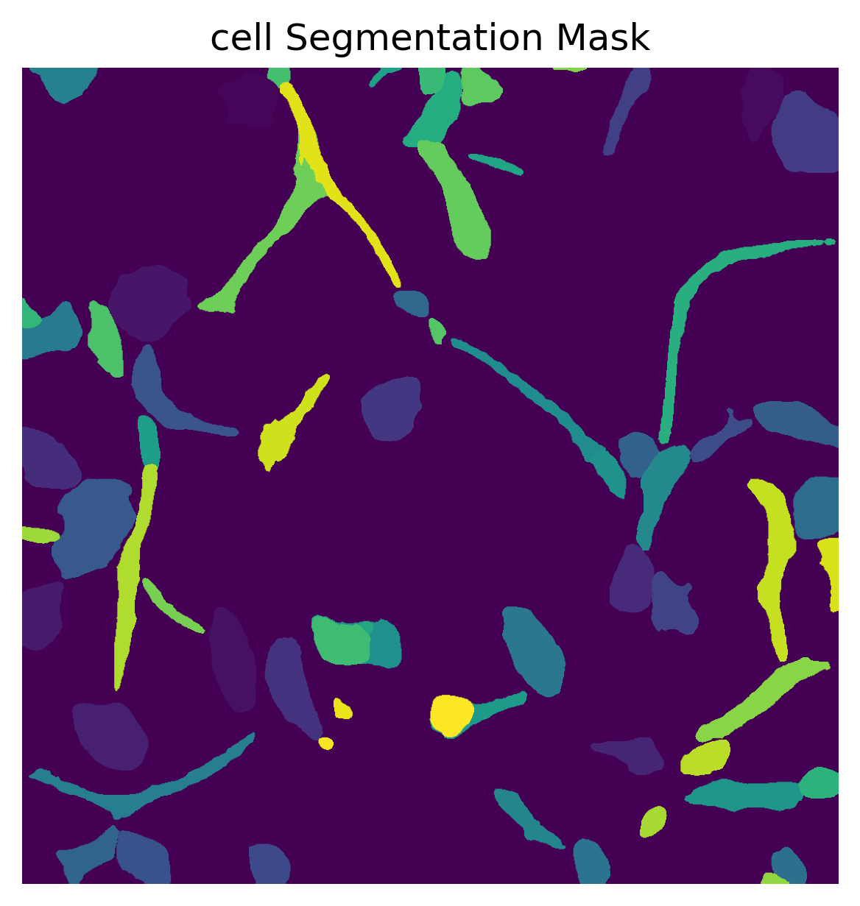
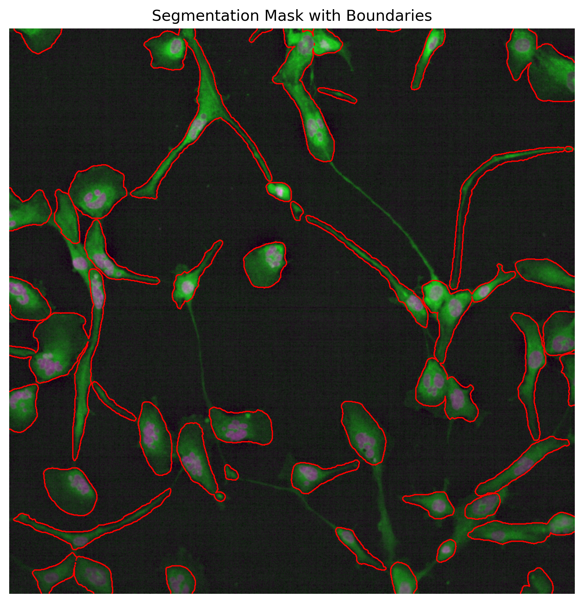
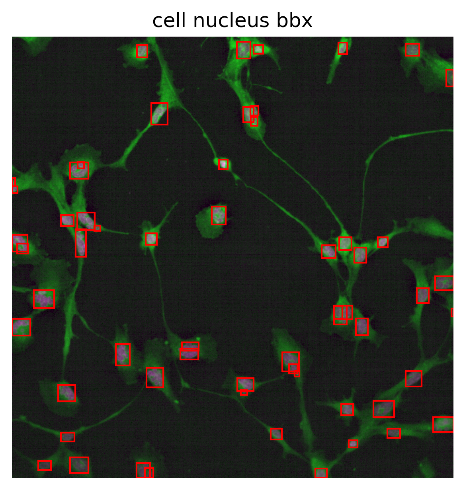
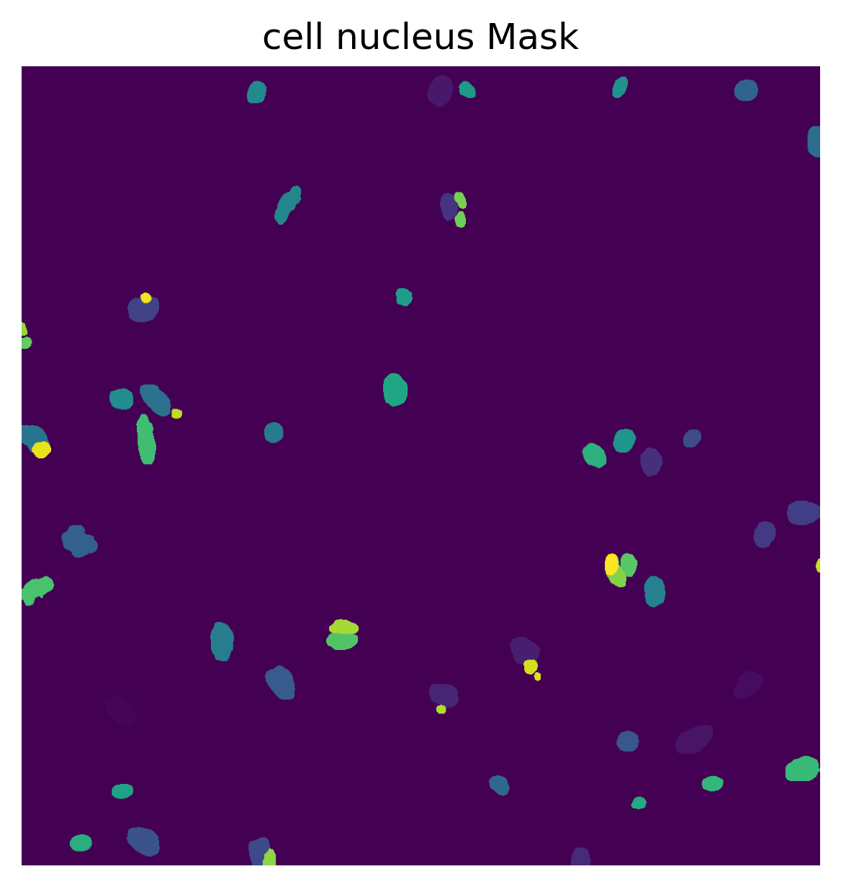

# Cell Painting image Analysis with Different dose rate

## 1. Description
This repository provides code for cell painting image segmentation.

### 1.1. Getting started
The easiest way to get started with CellSAM is with pip
`pip install git+https://github.com/vanvalenlab/cellSAM.git`
(see section [2](#2-target-hpc-platforms) for the environment setup per 
a corresponding HPC platform)

CellSAM requires `python>=3.10`, but otherwise uses pure PyTorch. 
A sample image is included in this repository. 

### 1.2. Cell segmentation

See example python script [`cell_segmentation.py`](src/cell_segmentation.py)

<p align="center">
  
  &nbsp;&nbsp;&nbsp;&nbsp;
  
</p>

### 1.3. Cell nucleus segmentation

See example python script [`cell_nucleus_segmentation.py`](src/cell_nucleus_segmentation.py)

<p align="center">
  
  &nbsp;&nbsp;&nbsp;&nbsp;
  
</p>

For more details for batch inference, see [`test_all.py`](src/test_all.py).

## 2. Target HPC platforms

### 2.1. Polaris (ALCF/ANL)

Create virtual environment
```shell
export PYTHONNOUSERSITE=True
module use /soft/modulefiles; module load conda
conda create -y -n ve.cellsam python=3.10
conda activate ve.cellsam
```

Install tools
```shell
pip install git+https://github.com/vanvalenlab/cellSAM.git
pip install matplotlib
```

Get this repository with examples
```shell
git clone https://github.com/radical-collaboration/LUCID.git
```

Run interactive job
```shell
qsub -I -l select=1 -l filesystems=home:eagle -l walltime=00:30:00 \
     -q debug -A <PROJECT_NAME>
```

Execute examples above (sections [1.2](#12-cell-segmentation) and 
[1.3](#13-cell-nucleus-segmentation)) as `cell_segmentation.py` and 
`cell_nucleus_segmentation.py` respectively.
```shell
module use /soft/modulefiles; module load conda
conda activate ve.cellsam
python3 cell_segmentation.py
# OR python3 cell_nucleus_segmentation.py
```

## 3. With RADICAL-Pilot

TBD - prototype script is in the [wfms/](wfms)
