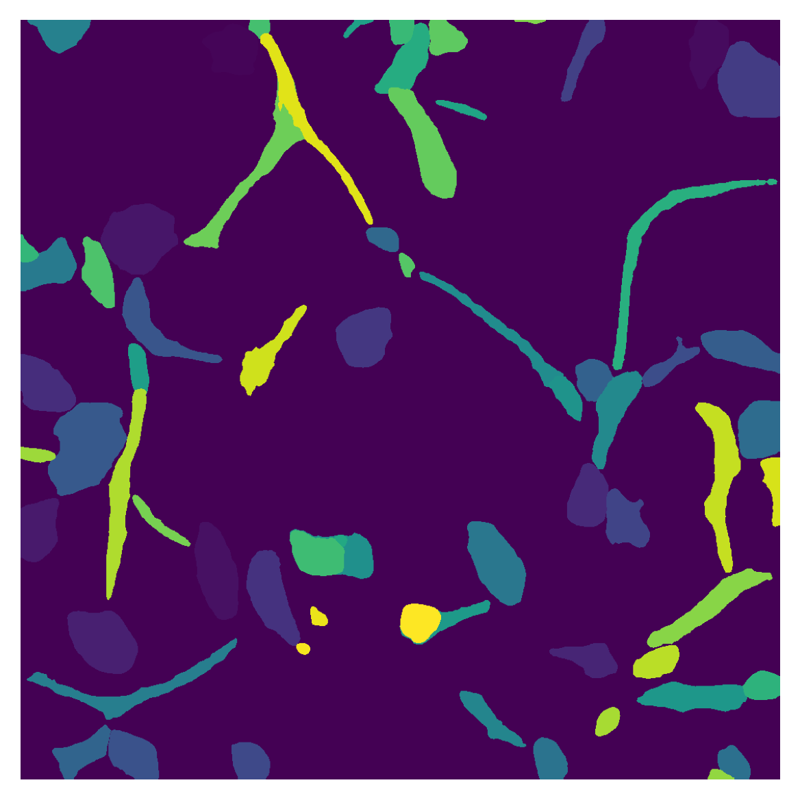

# Cell Painting image Analysis with Different dose rate

## Description
This repository provides code for cell painting image segmentation.

### Getting started
The easiest way to get started with CellSAM is with pip
`pip install git+https://github.com/vanvalenlab/cellSAM.git`

CellSAM requires `python>=3.10`, but otherwise uses pure PyTorch. A sample image is included in this repository. 

### Cell segmentation

```
import numpy as np
from PIL import Image
import matplotlib.pyplot as plt
from skimage import measure
from cellSAM.cellsam_pipeline import cellsam_pipeline

img = np.array(Image.open("/sample_imgs/r02c05f09p02.png"))

# Image is 3-channel RGB where Channel 1 (G) represents a nuclear stain
# and Channel 2 (B) a membrane stain. Channel 0 (R) is blank.

# Run the cellSAM pipeline to generate the mask
mask = cellsam_pipeline(
    img,
    low_contrast_enhancement=False,
    use_wsi=False,
    gauge_cell_size=False,
)[0]


# Normalize the mask to range 0 to 1
plt.figure()
plt.imshow(mask, cmap='viridis')
plt.axis('off')
plt.title("cell Segmentation Mask")
plt.savefig("r02c05f09p02_cell_mask.png", dpi=300, bbox_inches='tight')
plt.show()

# Find contours at level 0.5 on the normalized mask
contours = measure.find_contours(mask, level=0.001)
# Find contours for the mask

# Display the mask with boundaries
plt.figure(figsize=(8, 8))
plt.imshow(img)
for contour in contours:
    plt.plot(contour[:, 1], contour[:, 0], linewidth=1, color='red')

plt.axis('off')
plt.title("Segmentation Mask with Boundaries")
plt.savefig("r02c05f09p02_cell_mask_boundary", dpi=300, bbox_inches='tight')
plt.show()
```
<p align="center">
  
  &nbsp;&nbsp;&nbsp;&nbsp;
  
</p>

### Cell nucleus segmentation

```
import numpy as np
from PIL import Image
import torch
from scipy.ndimage import binary_dilation
import matplotlib.pyplot as plt
import matplotlib.patches as patches
from cellSAM import segment_cellular_image, get_model
import time

device = torch.device("cuda" if torch.cuda.is_available() else "cpu")
img = np.array(Image.open("/sample_imgs/r02c05f09p02.png"))

original_size = 1080
scaled_size = 1024
scale_factor = original_size / scaled_size

# Start time recording
start_time = time.time()

# Segment the cellular image
mask, embedding, bounding_boxes = segment_cellular_image(img[:, :, 0], bbox_threshold=0.35, normalize=True, device=str(device))
print(embedding.shape)

if mask is None or not hasattr(mask, 'shape'):
    print(f"Invalid mask for sample, skipping sample.")
    
bounding_boxes = bounding_boxes.cpu().numpy()
print(bounding_boxes.shape)

# End time recording
end_time = time.time()
elapsed_time = end_time - start_time

# Plot and save the mask only
plt.figure()
plt.imshow(mask, cmap='viridis')
plt.axis('off')
plt.savefig("r02c05f09p02_nucleus_mask.png", dpi=300, bbox_inches='tight')
plt.show()

# Plot and save the image with bounding boxes only
fig, ax = plt.subplots()
ax.imshow(img)
for bbox in bounding_boxes:
    xmin, ymin, xmax, ymax = bbox
    xmin_new = xmin * scale_factor
    ymin_new = ymin * scale_factor
    xmax_new = xmax * scale_factor
    ymax_new = ymax * scale_factor
    width = xmax_new - xmin_new
    height = ymax_new - ymin_new
    rect = patches.Rectangle((xmin_new, ymin_new), width, height, linewidth=1, edgecolor='r', facecolor='none')
    ax.add_patch(rect)

plt.axis('off')
plt.savefig("r02c05f09p02_nucleus_bbx.png", dpi=300, bbox_inches='tight')
plt.show()

binary_mask = (mask > 0).astype(np.uint8)

# If the original image is in RGB, expand the binary mask to 3 channels
if img.ndim == 3 and img.shape[2] == 3:
    binary_mask = np.stack([binary_mask] * 3, axis=-1)

# Multiply the original image with the binary mask to get the masked image
masked_image = img * binary_mask

# Save the masked image
Image.fromarray(masked_image).save("r03c10f01p01_only_nucleus.png")

print(f"Elapsed time for processing: {elapsed_time:.2f} seconds")
```

For more details, see `test_all.py`.


